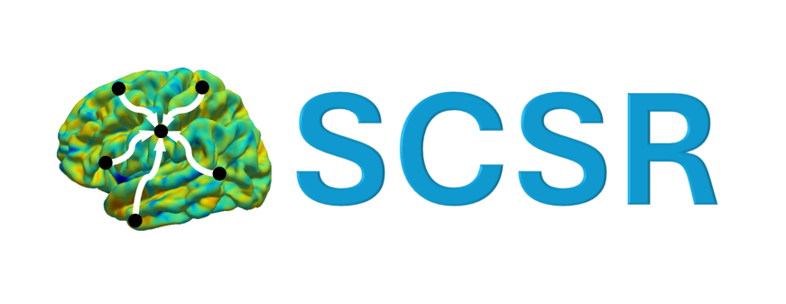

# SCSR-core

Official implementation of Stochastic Cortical Self-Reconstruction (SCSR). 




## Installation

1. Check out repository
2. Create environment: `conda env create --file environment.yml`
3. Activate environment: `conda activate SCSR`
4. Download model https://drive.google.com/file/d/1qmD5m3wR1F_sqVmBTyZgWWxi_VCpEbKz/view?usp=sharing and copy to directory `checkpoints`


## Data

We used data from [Alzheimer's Disease Neuroimaging Initiative (ADNI)](https://adni.loni.usc.edu/).

## Usage

- The package uses [PyTorch](https://pytorch.org)
- As input data, an input table with columns ['DX', 'AGE', 'PTGENDER', per-vertex values] is expected as a .feather file
- To train SCSR, set the path to the input table `table_path` in the training file and call `python SCSR_train.py config_files/training_configs/config.yaml`. 
- For sampling, again set the path to the input table `table_path` in `SCSR_sample.py`. We provide a minimal working example by default using `data/sample_data.feather`, which can be run by calling `python SCSR_sample.py`. The resulting cortex maps & Z-scores can be visualized on [FreeSurfer](https://surfer.nmr.mgh.harvard.edu/) surfaces, e.g., using [visgeom](https://github.com/fabibo3/visgeom).


## Citation

```bibtex
@article{wachinger2024stochastic,
  title={Stochastic Cortical Self-Reconstruction},
  author={Wachinger, Christian and Hedderich, Dennis and Bongratz, Fabian},
  journal={arXiv preprint arXiv:2403.06837},
  year={2024}
}
```
